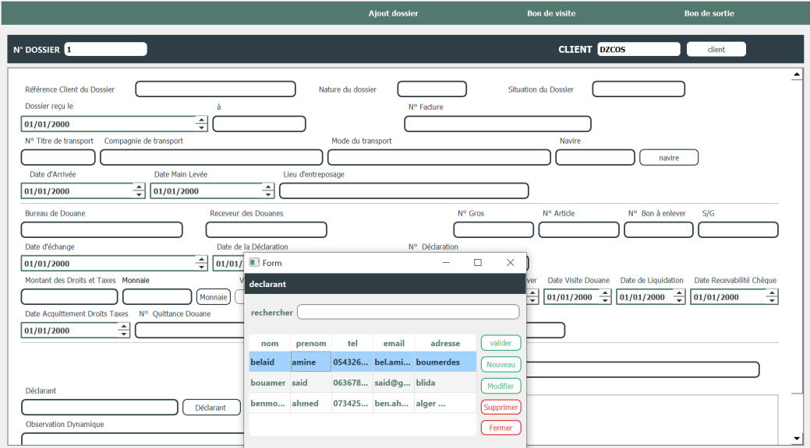

# **Introduction :**
Ce manuel d’utilisation a un but de vous guider dans votre navigation dans notre application desktop. Il vous présentera par la suite l’application de manière général, simplifiera votre contact avec les interfaces à travers de ses différentes fonctionnalités du logiciel

# **Présentation de l’application :**
*« AZMA PARC »* est un logiciel pour la gestion des facturations et aussi une application Desktop destinée aux entreprises de la facturation des marchandises qui est en relation avec la douane « AZMA PARC » dont l’intérêt est d’assurer la gestion des marchandises du client et faire une facture de chaque entreprise « client ».

Il permet aux utilisateurs de faire une gestion complète de chaque client à travers d’un dossier, marchandise et aussi la gestion de diffèrent élément chauffeur, navire, les factures, contact….  

**Visite guidée :**

` `**Premier menu :**

Au lancement du logiciel, la première fenêtre qui vous est affichée est la page de login

### **Interface de connexion :**

Pour vous connectez, vous devez vous authentifier à travers votre *Nom d’utilisateur* et votre *Mot de passe*, ce dans la fenêtre de connexion ci-dessous :

`         `

Des messages vous seront affichés pour vous aider à corriger les informations entrées en cas d’erreur par la suite :

. Une fois connectés, vous êtes prêts à naviguer à travers le logiciel, et vous avez face à vous, le menu principal « page d’accueil » après la connexion de votre compte.

***Page d’accueil :***

Voici le menu principal de notre logiciel qui comporte 4 sous-sections (dossiers, factures, ressources humaines, ressources matérielles) comme indiqué à gauche de cette interface :

**L’interface « ajout dossier » :**

` `Concernant l’interface ajout dossier, elle contient 2 pages avec des champs pas forcément tout obligatoires.

- La page 1 de « ajout dossier » qui contient les champs de client, navire, déclarant, monnaie :  

- La page 2 de « ajout dossier » qui contient les champs de marchandise, pays comme suit :  

**Sélection client :**

Pour sélectionner un nouveau client, il faut cliquer sur le bouton « client » en haut à droite de la page 1 de « ajout dossier » pour ajouter ou bien modifier ou bien supprimer un client, comme suite :

-le bouton « rafraichir » c’est pour faire la mise à jour de la table de client qui précède par le bouton « valider »  

**Sélection déclarant :**

Pour sélectionner un nouveau déclarant, il faut cliquer sur le bouton « déclarant » en bas de la page 1 de « ajout dossier » pour ajouter ou bien modifier ou bien supprimer un déclarant précédé par le bouton « valider », comme suite :

**Sélection marchandise :**

Il faut remplir les champs de marchandise dans la page 2 de « ajout dossier » (les champs de : désignation marchandise, nbr cols, poids brut, nature marchandise) pour ajouter la table de marchandise précédé par le bouton « valider », comme suite :

**Sélection monnaie :**

Pour sélectionner une nouvelle monnaie, il faut cliquer sur le bouton « monnaie » en bas de la page 1 de « ajout dossier » pour ajouter ou bien modifier ou bien supprimer monnaie (elle contient le code et libellé monnaie) précédé par le bouton « valider », comme suite :

**Sélection navire :**

Pour sélectionner un nouveau navire, il faut cliquer sur le bouton « navire » en haut à droite de la page 1 de « ajout dossier » pour ajouter ou bien modifier ou bien supprimer navire précédé par le bouton « valider », comme suite :

**Sélection pays :**

Pour sélectionner un nouveau pays, il faut cliquer sur le bouton « pays » en haut à droite de la page 2 de « ajout dossier » pour ajouter ou bien modifier ou bien supprimer pays (il contient le code et le pays) précédé par le bouton « valider », comme suite :

**Champs obligatoires :**

Avant de valider les champs, il faut bien saisir les champs qui sont obligatoires relatifs au l’interface qu’on veut la remplir 

- Par exemple, si on veut laisser les champs obligatoires sans les remplir dans l’interface ajout dossier « page 1 », et on valide les informations qu’on a saisi, il nous affiche en rouge erreur (des champs obligatoires) comme suite :

- Les informations en rouge représentent des champs obligatoires à remplir

**Bon de sortie :**

Dans l’interface de bon de sortie, vous pouvez ajouter ou bien modifiez ou bien supprimer un bon de sortie précédé par les boutons « nouveau, modifier, supprimer » dans la table comme suit :

**Bon de visite :**

Dans l’interface de bon de visite, vous pouvez ajouter ou bien modifiez ou bien supprimer un bon de visite précédé par les boutons « nouveau, modifier, supprimer » dans la table comme suit :

**L’interface de la facture :**

` `Concernant l’interface ajout facture, elle contient une seule page avec des champs pas forcément tout obligatoires comme suite :

- Pour sélectionner un nouveau dossier, il faut cliquer sur le bouton « N dossier » en haut à droite de « ajout facture » pour ajouter ou bien modifier ou bien supprimer dossier, comme suite :

Pour ajouter prestation/debour, il faut cliquer sur le bouton « Nouveau » en haut à droite de « ajout facture » pour ajouter ou bien valider les informations, comme suite :

Si vous cliquer sur ajouter dans prestation/debour vous pouvez ajouter ou bien modifier ou bien supprimer une prestation ou bien debour selon le type qu’on a, comme suite :

**Ressources humaines :**

Dans l’interface ressources humaines, vous pouvez ajouter, modifier, supprimer un client ou bien un déclarant 

- Par exemple :

- Si vous cliquez sur ajouter, il s’affiche l’interface de « ajouter un nouveau client », comme suite :

") 

- Si vous cliquez sur information de l’entreprise, il s’affiche l’interface de « information de l’entreprise », comme suite :

- Si vous cliquez sur information mandat et registre de commerce, il s’affiche l’interface de « mandat et registre de commerce », comme suite :

**Ressources matérielles :**

- **Les interfaces du navire :**
- Voici un exemple pour ajouter un navire :

- Voici un exemple pour modifier un navire :

- **Les interfaces du pays :**

-Voici un exemple pour ajouter un pays :

- Voici un exemple pour modifier un pays :

`    `***Agréable navigation !***

